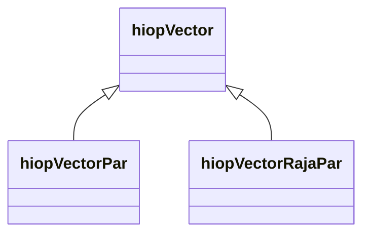
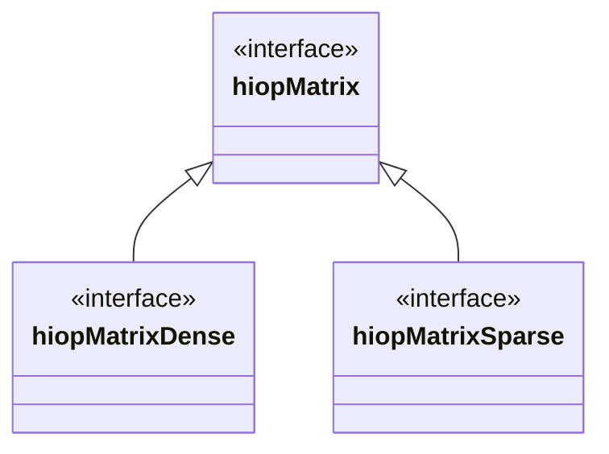
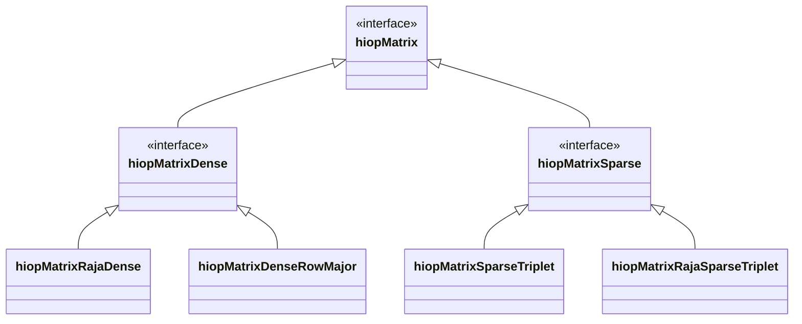
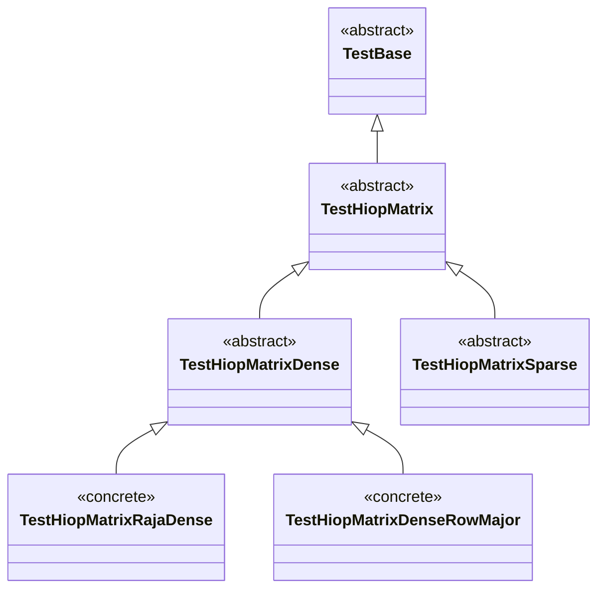
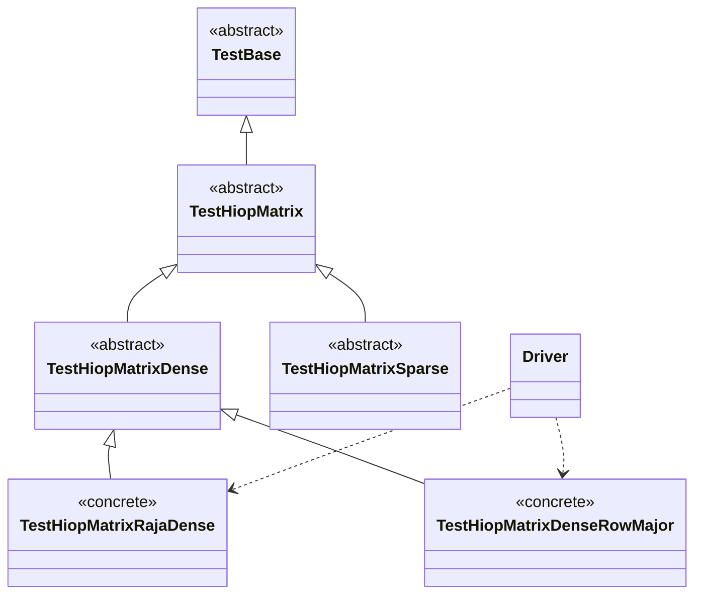

Design principles apply to your tests more often then you might think!



## Intro

When designing tests, qualities like code reuse, readability, and execution time
are not often considered.
In this post, I'll look at how we designed the test suite for
[HiOp](https://github.com/LLNL/hiop), a high performance optimization solver.
Credit for the design goes to [Slaven Peles](https://www.linkedin.com/in/slavenpeles/)
inspired by the [Sundials](https://github.com/LLNL/sundials) test suite.

HiOp's unit test suite was crucial for the following reasons:

1. We needed to be sure our linear algebra library would perform as expected
  after porting the entire thing to use [RAJA](https://github.com/LLNL/RAJA)
  portability library, and
1. Our timelines were quite aggressive, considering the size of our team and
  the scope of our porting efforts.

For these reasons, we needed to develop a thorough suite of unit tests to
*verify execution* of our linear algebra kernels after porting to leverage GPU
devices with an extremely quick turnaround time.
*Code reuse and readability were crucial to our development effort*.

## Problem Domain and Design Decisions

HiOp's linear algebra library uses a clean inheritance structure.
Looking at the `hiopVector` abstract interface for example, there are two
implementations, `hiopVectorRajaPar` and `hiopVectorPar`, as seen below:

Before we had written the `hiopVectorRajaPar` implementation, we had to establish
success criterea for our implementation in the form of unit tests and integration
tests.
When we began, we had exactly zero unit tests, so again, code reuse and
developer productivity would be very important.

We settled on a unit testing structure that would mimick the inheritance
design already in place with the linear algebra library.
Test classes would mirror the system under test such that tests for concrete
classes would inherit from test classes for the abstract interfaces.

Let's use the `hiopMatrix` class as an example.

## `hiopMatrix` Example

The top-level interface for HiOp matrices is the `hiopMatrix` pure virtual class.
The `hiopMatrixDense` and `hiopMatrixSparse` pure virtual classes are children
of `hiopMatrix`.

From there, each of the two abstract children have regular CPU-bound
implementations and RAJA-based GPU/OpenMP implementations:

At each level in this inheritance structure, new methods are added to the interfaces.
For example, due to memory layout constraints, some methods are feasable only with a
`hiopMatrixDense` and do not make much sense with a sparse matrix.
Thus not all tests for `hiopMatrixDense` apply to `hiopMatrixSparse`.

To maximize code reuse, we developed the following inheritance structure for our tests:
`TestBase` contained code common to all test classes, such as MPI reduction of
error codes, pretty-printing test results, floating point comparisons, etc.

Each of the highest-level linear algebra classes then has a corresponding test
class which inherits from `TestBase`, eg `TestHiopMatrix` and `TestHiopVector`.
These test classes, just like their corresponding classes in the linear algebra
library, are abstract - they define tests only for the corresponding interface.

Child classes of each of these classes implement tests specific to the implementation.
These classes are concrete, and are used to finally test their respective implementation.
I've ommitted the full structure for the `TestHiopMatrixSparse` side of the
inheritance chain to make the diagram more readable below.

See the bottom of this graph - the test driver instantiates an instance of
each concrete test class and runs all contained tests.

When the driver is ran, every test all the way up the inheritance chain is run
on each implementation.
Tests that apply to all `hiopMatrix` classes are run on an instance of every
concrete child class:

* `TestHiopMatrixRajaDense`
* `TestHiopMatrixDenseRowMajor`
* `TestHiopMatrixSparseTriplet`
* `TestHiopMatrixRajaSparseTriplet`

The concrete child classes enumerated above implemented methods specific to the
implementation that were needed for the test (eg copying memory back and forth
between host and device when running with CUDA or HIP).
This strategy saved us an *enormous* amount of developer time and lines of code,
and also ensured that every implementation conforms to every interface it implements.

## Conclusion

As we developed our test suite, we concurrently developed the RAJA
implementations of each linear algebra class.
For each method of each linear algebra class, we first wrote a test and then
ported the core of the method to run in a RAJA kernel.

Thanks to this strategy, we were able to port the entire optimization engine
library HiOp to leverage CUDA, and HIP, and OpenMP acceleration platforms with
a high degree of certainty that our kernels perform correctly.
HiOp currently only runs in unified virtual memory, and we are actively
developing the last parts of the optimization routines such that the solver can
run entirely in device memory.



## References

1. [Slaven Peles's GitHub profile](https://github.com/pelesh)
1. [Original PR for HiOp's polymorphic test suite](https://github.com/LLNL/hiop/pull/41)
1. [HiOp](https://github.com/LLNL/hiop)
1. [HiOp's current linear algebra test suite](https://github.com/LLNL/hiop/tree/master/tests/LinAlg)
1. [Sundials test suite](https://github.com/LLNL/sundials/tree/master/test/unit_tests/arkode)
