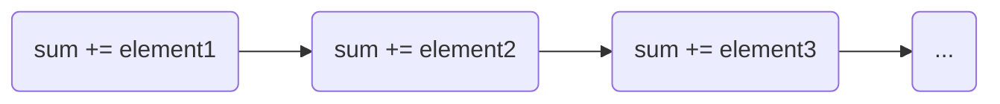

First lessons in distributed and high-performance computing.

### Intro

High-performance computing (HPC) is an exciting field with a rich history.
While its namesake is perhaps a bit daunting, most of the principles are more approachable than one might expect.
This series will look at some first lessons in HPC, seasoned with some interesting HPC history.

### Problem Formulation

The first concept in HPC we'll look at is *distribution mechanisms*.
In layman's terms, this concept encapsulates *different strategies employed by
programs to split up computations and operations between different units of execution*.

For example, let's imagine a landscaping business has six lawns to mow and trim, four employees, and 3 lawnmowers.
How would you optimally divide the work between your equipment and employees?
This is very much like HPC jobs - you must determine how you would like to split
your computational work (lawns to mow) between your hardware resources (employees and equipment).

Let's take a look at a more concrete computational example.

#### Concrete Example

Let's imagine that for some interesting HPC application, you are tasked with
calculating the sum of a very long array:

```python
>>> data = [ 0.2, 5.3, 1, 65.4, ...]
>>> len(data)
5000
```

*Note: 5,000 elements is not actually a very long array in HPC terms, and it is
very unlikely you want to write an HPC application in Python, however we will
use this example for demonstration purposes.*

To calculate the sum of all elements in this array, the most trivial solution
would be to iterate over every element and add each element to the rolling sum.

```python
sum = 0
for element in data:
    sum += element
```

This algorithm might be visualized like so:



This algorithm is termed *sequential* because all operations are performed in a
single *sequence*.
Sequential algorithms are usually undesireable.
The correlation to our landscaping company example would be using only a **single
employee** using a **single piece of hardware** to mow every lawn and trim every hedge.

The computer you are using right now likely has many *cores* capable of many *processes*.
These cores are akin to the employees of the landscaping company.

*Note: hardware threads, cores, OS threads, greenthreads, and many other terms
are used for agents of execution. These terms do not all mean the same thing.
In this series, we will use the term **process** to indicate a unit of execution.
This term is not perfect, but I think it communicates enough for the purposes of
this series.*

If this is unfamiliar to you, perhaps run the `top` command on Darwin/Linux or
the Task Manager on Windows to get an idea of how many processes your system is
capable of.

Using the sequential algorithm above is much like the landscaping business
scheduling their employees like so:

```mermaid!
gantt
dateFormat DD
axisFormat %d
title Landscaping company schedule

    section Employee 1
    Mow first lawn : e1-1, 01, 2d
    Mow second lawn : e1-2, after e1-1, 2d
    Mow third lawn : e1-3, after e1-2, 2d
    Trim first hedge : e1-4, after e1-3, 1d
    Trim second hedge : e1-5, after e1-4, 1d

    section Employee 2
    Do nothing... : e2-1, 01, 8d

    section Employee 3
    Do nothing... : e3-1, 01, 8d
```



You've got several employees doing nothing, while one employee does all
the work!
This algorithm took 9 days.
Let's reorganize our work a bit, assuming we have *one lawnmower* and *one
hedgetrimmer*:

```mermaid!
gantt
dateFormat DD
axisFormat %d
title Landscaping company schedule

    section Employee 1
    Mow first lawn : e1-1, 01, 2d

    section Employee 2
    Trim second hedge : e2-1, after e3-1, 1d
    Mow second lawn : e2-2, after e1-1, 2d

    section Employee 3
    Trim first hedge : e3-1, 01, 1d
    Mow third lawn : e3-2, after e2-2, 2d
```



This is a *little bit* better, but not much better - still 7 days.
Let's introduce *three* lawnmowers and *two* hedgetrimmers:

```mermaid!
gantt
dateFormat DD
axisFormat %d
title Landscaping company schedule

    section Employee 1
    Mow first lawn : e1-1, 01, 2d
    Trim first hedge : e1-2, after e1-1, 1d

    section Employee 2
    Mow second lawn : e2-1, 01, 2d
    Trim second hedge : e2-2, after e2-1, 1d

    section Employee 3
    Mow third lawn : e3-2, 01, 2d
```



You can see that the introduction of sufficient resources resulted in less than
half the execution time of our algorithm - but this does not just apply to
mowing lawns!
In HPC, the restructuring of an algorithm to better utilize the available resources
often extends the reach of domain science, and directly impacts the world.
This is important stuff!

### Distribution Mechanisms

### References

1. [LLNL HPC Training Materials](https://hpc.llnl.gov/training/tutorials/introduction-parallel-computing-tutorial)
1. [LLNL Slurm & Moab Training Materials](https://computing.llnl.gov/tutorials/moab/)
1. [LLNL MPI Training Materials](https://computing.llnl.gov/tutorials/mpi/)
