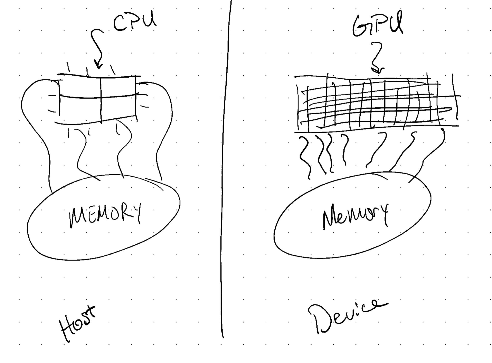

## intro

Hey! Today we'll build a mental model for writing code for a GPU, and we'll take a look at a short code snippet.

If you're interested in GPU programming but you've never had a chance to use it or learn about it, this video could be a great place for you to start.

Let's get started.

## Device vs host

The first thing to keep in mind when you're writing CUDA is that you're essentially writing code for two mostly separate machines.

### CPU

When writing code only for your CPU, you have some resources with which you can perform some calculations.

Say if you have a 4 core CPU, you might reasonably spawn four threads to do some work at the same time.
In reality it's a bit more complicated than that since your operating system will be switching in between tasks in a way you can't easily control, but at least mentally, you have access to four workers in this case.

Now in our simplified model of programming for a multicore CPU, each of the threads on each core has access to a pool of memory.
This memory could be statically or dynamically allocated, and in reality this memory may physically exist in your RAM, or in one of your many caches, but for now let's just think of this as a general pool of memory that any of your CPU cores can read from and write to.

### GPU

When writing code for a GPU, you have another similar setup.
The GPU is a physical card with many many cores.
Each of these cores has access to a separate pool of memory.
Again, the physical layout of the memory is complex, but let's just think of the GPU memory as a single pool for now.

If you have some memory residing in the CPU memory pool that you want to perform some work on on your GPU, you will have to copy that over to the GPU before performing any calculations.
Just like you might call the standard C function `memcpy` to copy memory between two locations in your CPU's memory, the CUDA API provides a function `cudaMemcpy` that allows you to copy memory between CPU memory and GPU memory.

### Summary

This divide here in the middle separates the _host_ from the _device_.
If someone refers to the _host memory space_, that's this memory here on the left.
If someone refers to the _device memory space_, that's the GPU's memory on the right.

The _host execution space_ refers to the CPU cores, and the _device memory space_ refers to the GPU cores.

## Code Snippets

If we look at this example problem, you'll see all of these elements at play.

1. Up at the top, we have a kernel that squares a single element of an array. You can see it's annotated with `__global__`, which means this function can be called from the host and executed on the device. This function will be called on each thread that is launched, which we'll see below.
1. Next we set up some memory on the host, setting each element of this array to it's index.
1. Then we allocate some memory on the device, and copy the host memory to the device memory.
1. Here is where we launch the GPU kernel we looked at above. This strange syntax with the triple angle brackets is how you execute code on a GPU, in the device execution space. There are four possible arguments to the triple angle brackets two of which are mandetory. In short, these launch arguments will result in 64 threads being spun up on the GPU. If we return to the kernel launch, we're using `threadIdx.x` to determine the index in the array we'll operate on. The reason we have this if statement is because it's better to make the number of threads you launch a multiple of the number of threads in a block, which is often 32. This means we may launch more threads than are needed, so we have this check before doing any work.

## Outro

I hope you all enjoyed this video and stay tuned for the next few videos.
I have some more introductory CUDA content in the works.
Peace!
