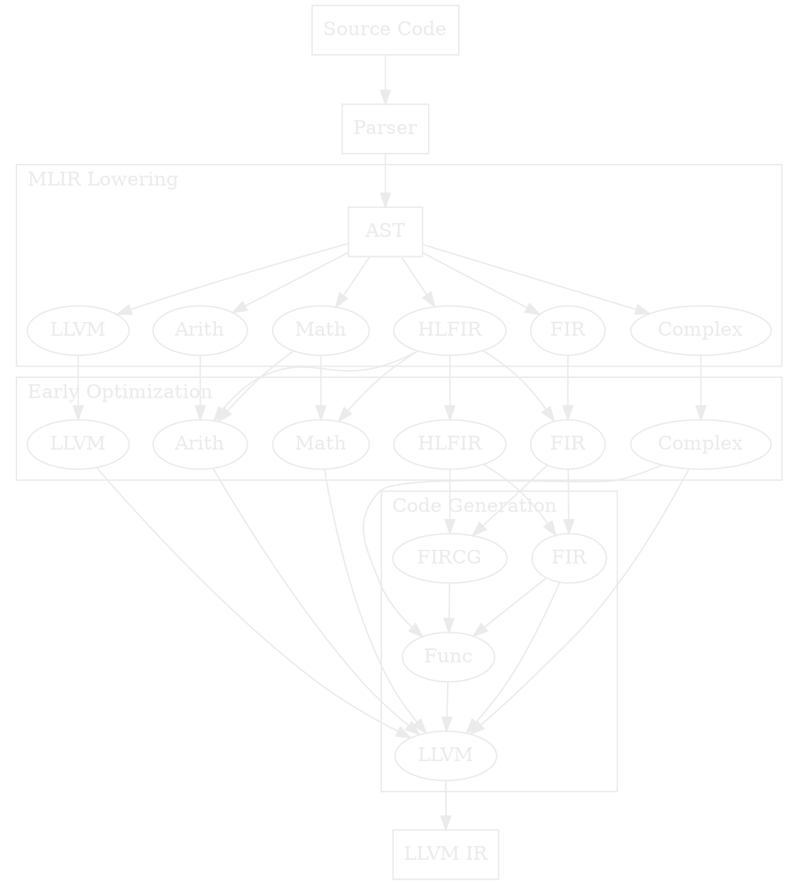
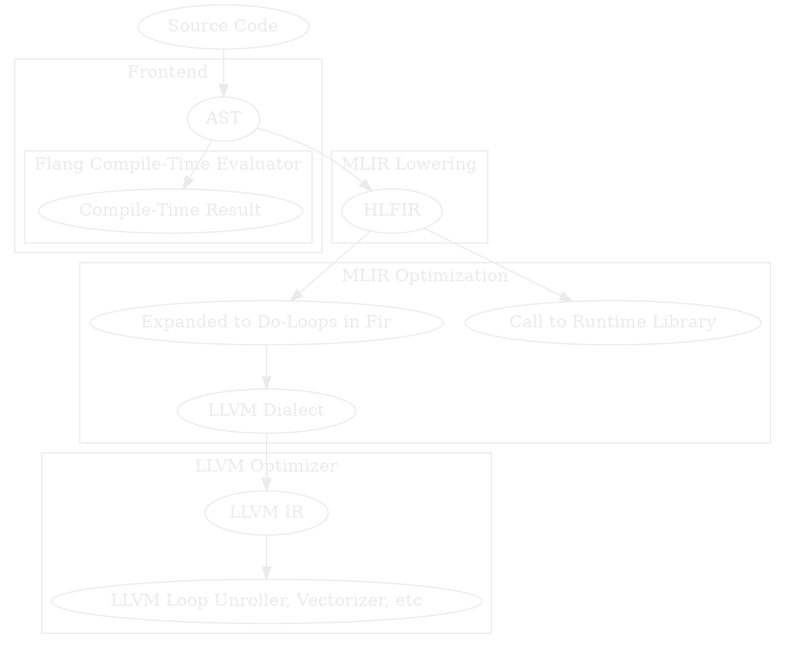

# The Unreasonable Effectiveness of Progressive Lowering

_7/26/2025_

Thoughts on why progressive lowering is so effective in MLIR.

- [The Unreasonable Effectiveness of Progressive Lowering](#the-unreasonable-effectiveness-of-progressive-lowering)
  - [Micropass Architecture](#micropass-architecture)
  - [_Dialects_ in MLIR](#dialects-in-mlir)
  - [Flang's Progressive Lowering](#flangs-progressive-lowering)
    - [The Life of a Matmul](#the-life-of-a-matmul)
  - [Co-Existence of Dialects](#co-existence-of-dialects)
  - [Clang as an Example](#clang-as-an-example)

## Micropass Architecture

MLIR rhymes with other compiler technologies [like the nanopass architecture](https://docs.racket-lang.org/nanopass/index.html) in which the compiler is built up of many small passes and IRs that are composed together, but it is different in a few key ways.

The notion of _progressive lowering_ is core to MLIR.

~~~admonish tip title="_Progressive Lowering_"

Other compiler technologies like LLVM have a lowering or code generation phase in which the IR is generated by the frontend and then optimized.
_Progressive lowering_ is the idea that the frontend generates a high-level IR, and then the IR is progressively lowered and optimized along its way to the final IR.

~~~

In a nanopass architecture, [the compiler may translate the IR into a new, short-lived format, run a pass or two on it, and then translate it to another IR](https://docs.racket-lang.org/nanopass/index.html).

MLIR on the other hand, is capable of representing lots of different IRs _in the same module_.
These different IRs are called _dialects_.

## _Dialects_ in MLIR

MLIR is one of the larger developments in compiler technology in the last decade, but some key components of MLIR are not used by some of the most popular MLIR-based projects.

The MLIR dialects that exist in the upstream LLVM repository are considered the _upstream dialects_.
There used to be a notion of _standard dialects_.
This nomenclature has been dropped, you will still find mention of these _standard dialects_ online.

[The Mojo language is a perfect example](https://www.modular.com/mojo) - Chris Lattner's startup is built the Mojo language, which uses an MLIR-based compiler, but does _not use any_ of the standard dialects.

Part of the reason for this is, in my opinion, that the construction of dialects is so easy.
There is essentially no cost to relying exclusively on your own dialects (as Chris Lattner's team does).
There are other reasons as well - so many different teams depend on MLIR and have different constraints.
Finding a common set of dialects that meet everyone's needs is difficult.

## Flang's Progressive Lowering

~~~admonish important title="_Keep the High Level Info in the IR!_"
Most compilers make the tradeoff of having the high-level information about the user's program in the AST, but once lowered to the IR, much of it is lost.

Flang is unique in that it compiles general-purpose programs (meaning _not AI kernels_) _and_ retains high-level information in the IR.
Abstract features in the source language (like `where` clauses) are represented in the highest-level IR, and arrays are often not bufferized.
The IR is optimized and lowered progressively.
~~~

This is a rough sketch of the dialects that Flang uses internally in the process of lowering Fortran code to LLVM IR.
Apologies for the chaotic diagram - the actual lowering pipelines can become quite complex.
[This is what the construction of the default optimization pipeline in Flang looks like.](https://github.com/llvm/llvm-project/blob/4775b96/flang/lib/Optimizer/Passes/Pipelines.cpp#L167)

### The Life of a Matmul

Matrix multiplication is a great example of the flexibility of Flang's progressive lowering:

At each point in this process, many MLIR dialects might be co-existing in the same IR for one translation unit.

This is even still a simplified view of the compilation process; at each stage, many other analyses passes are run which might transform the matrix multiply.
Canonicalization patterns and folding happen very often, for example.

## Co-Existence of Dialects

Why is it that all of these dialects, some upstream in the MLIR project and some in Flang, can co-exist in one compiler?

One key feature of MLIR as a format for analyzing and transforming IRs is that dialects can nearly always compose.
You may create a new dialect to serve your purposes and integrate with upstream (and even other downstream) dialects.
MLIR dialects can implement interfaces that the rest of the MLIR infrastructure uses.
Upstream transformations can work relatively well on downstream dialects because MLIR as compiler infrastructure allows the downstream dialects to communicate the things upstream analyses need to know.
For example, the MLIR project contains a CSE pass for removing redundant operations - so long as a downstream dialect sufficiently implements the memory effects interfaces on their operations, the CSE pass is able to reason about the IR without knowing anything more about the dialect.

## Clang as an Example

When we look at Clang, we see a much more discrete compilation process: the source code is parsed into an AST and some AST-level passes run, and then it is lowered to LLVM IR where the lower-level optimizations run.
Of course, there are higher-level and lower-level semantics represented in LLVM IR, but not nearly to the not nearly to the extent that MLIR is capable of.

This firm break between the higher-level AST and the lower-level LLVM IR means that some optimizations might not be possible to the same degree as in Flang.

There are, of course, historical reasons for this and I am a huge fan of Clang.
This may even be remedied at some point by [the CIR project](https://llvm.github.io/clangir/).
If you look at [the operations defined in the CIR dialect](https://github.com/llvm/llvm-project/blob/main/clang/include/clang/CIR/Dialect/IR/CIROps.td), it is still relatively low-level compared to the rich information that Flang retains in its HLFIR dialect.
It's a long road to be able to represent the complicated semantics of C and C++ in a high-level IR like HLFIR, but the CIR project is already a step in that direction, and I can't wait to see how it evolves.
