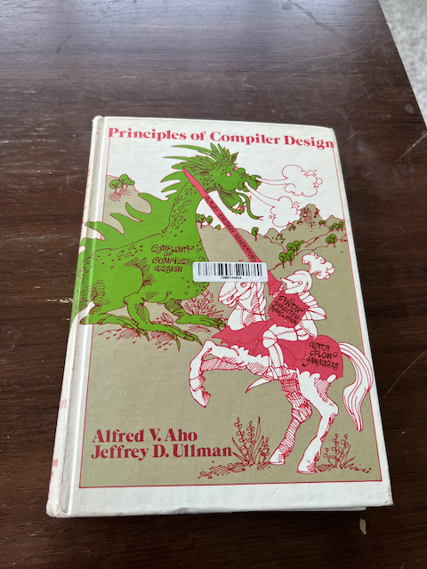

# History of PL and Compilers

OO vs FP can be thought of as Aristotle vs Plato (though IMO prolog is a better analogy for Plato because of it's declarative emphasis on relationships)

## Ancient Greek Philosophy (5th-4th century BCE):

- Plato et al laid the groundwork for understanding language and its relationship to knowledge.
- Concept of a *Logical Grammar*: might be thought of as a context-free grammar or a grammar specification. Followed up by the Universal Grammar (later).
    <!-- - Theory of innate knowledge, known as "Plato's Problem," posed the question of how humans acquire so much knowledge despite limited experiences. This concept would later influence linguistic theories. -->
<!-- 1. Enlightenment Era (17th-18th century): -->
<!--     - René Descartes and the rationalist movement further developed ideas about language acquisition, believing in its innate nature as a reflection of human rationality. In contrast, John Locke proposed that all knowledge, including language, comes from sensory experience rather than innate abilities. -->

## Early Computing Concepts (Early 20th century):

- The Antikythera mechanism, dating back to ancient Greece, is often cited as an early analog computing device. In the early 20th century, pioneers like Ada Lovelace contributed to the foundations of computer science by writing the first algorithm for Charles Babbage's Analytical Engine.


## Chomsky's Universal Grammar

Though happening chronologically at the same time as the following section on the 1950s, Chomsky's Universal Grammar needs its own section.

- He formalized the idea that natural languages have underlying structure and that languages are not fundamentally different nor a concrete *thing* on their own separate from the social environment.
    - Chomsky developed *formal grammars* part of the Chomsky hierarchy.
    - Context-free grammars from Chomsky's hierarchy are used in compiler design to define the syntax of programming languages.
        They form the basis for parsing techniques like recursive descent parsing and LALR parsing.
    - The concept of deep structure in Chomsky's linguistic theory parallels the use of abstract syntax trees (ASTs) in compiler design. ASTs represent the hierarchical syntactic structure of code, similar to how deep structure represents the underlying structure of natural language sentences.
    -  This provides theoretical foundations for parsing and compiler construction.

- John Backus (inventor of Fortran at IBM) developed a programatic format for describing grammars.
    - The notation was used in the original draft of Algol60.
    - Originally coined *Backus normal form*, this was later reworded by Donald Knuth to be *Backus Naur form*

At the top of the Chomsky Hierarchy are *type-0* languages--those without any restrictions.
They are by definition very difficult to deal with.
The further down you go, the more restrictive the languages get, and the easier they are to work with programmatically (which is helpful from a parser's point of view).

Below type-0 is type-1 or *context-sensitive grammars*--those you cannot parse without carrying around some state.
For example, you cannot parse C++ without semantic analysis.
You *must* be able to look ahead or carry some state about the text being parsed in order to decide what the parser should do next.
This is part of why C++ is so difficult to work with from a compiler front-end's POV.

Type-2 are *context-free grammars*, meaning you need not carry any state with you as you parse the input.
Every input can be cleanly mapped to the output space without knowing the surrounding context.

A simple context-free grammar for a calculator that only adds or subtracts numbers might look like this ([bnf playground](https://bnfplayground.pauliankline.com/)):
```
<expression> ::= <term> | <expression> "+" <term> | <expression> "-" <term>
<term> ::= <integer> | "(" <expression> ")"
<integer> ::= <digit> | <integer> <digit>
<digit> ::= [0-9]
```

The angle brackets (`<` and `>`), `::=`, and quotes `"` are all that's needed for a bnf grammar (though I used the construct `[0-9]` in the above example, which I believe was not a part of the original BNF).

We'll talk more about this later.

## Early languages (~1950s)

1. Early 1950s: Grace Hopper coins the term "compiler", though it initially referred to what we'd now call a linker/loader. The first true compiler was developed by Alick Glennie for the Manchester Mark 1 computer in 1952.
    - Grace Hopper made significant contributions to early programming. In 1952, she developed the A-0 Compiler, which translated readable English keywords into machine code34. This was a crucial step towards more user-friendly programming interfaces.
    - These were essentially all streaming compilers (to be talked about more later).
1. FORTRAN and High-Level Languages (1950s):
    - John Backus led the development of FORTRAN at IBM, released in 1957. FORTRAN was the first high-level programming language, let scientists and engineers to write code without dealing directly with machine code. This marked a significant shift in making programming more accessible to non-specialists.
1. COBOL and Business Applications (Late 1950s):
    - Grace Hopper's work on FLOW-MATIC influenced the development of COBOL (Common Business-Oriented Language), which became the dominant language for business applications.
1. Lisp and Artificial Intelligence (Late 1950s):
    - John McCarthy developed Lisp in 1958, which became influential in artificial intelligence research.

## C and System Programming (1970s):

- Dennis Ritchie developed C at Bell Labs as a portable assembly
- Compiler theory!!!
    - "Dragon Book"[^dragonbook] in 1977 also at Bell Labs
- 1975: Stephen Johnson develops the Portable C Compiler (pcc), enabling easier porting of C to new architectures.


## Maturation of the Field (1970s-1980s):

- Advances in type theory and formal semantics lead to more sophisticated static analysis and verification in compilers.
- Languages like Smalltalk introduced object-oriented concepts, which later influenced the development of many modern programming languages6.
- Most compilers at this point are still proprietary. In the early days of computing, most compilers were proprietary and closed-source, developed by hardware manufacturers or specialized software companies.
- Each hardware platform typically had its own proprietary compiler, leading to a fragmented ecosystem. This made it difficult to port software between different systems, as code often needed to be substantially rewritten for each new platform.
- With closed-source compilers, only the original developers could make improvements or add features. This resulted in slower innovation compared to open-source models, where a broader community can contribute to development.

## Advent of Open Source (1990s-):

- The advent of open source compilers began with the release of GCC (GNU Compiler Collection) in 1987. GCC was a significant breakthrough as the first portable ANSI C optimizing compiler released as free software. It quickly became a foundation for free software development.
- LLVM, started in 2000 at the University of Illinois, emerged as another major open source compiler project. LLVM's modular design and intermediate representation allowed for greater flexibility and easier adaptation to different languages and architectures.
- rise in the FE/ME/BE seperation of concerns.
    - experts could focus on their area, everyone could collaborate.
    - could write a compiler FE to plug into GCC and leverate the nice backends that hardware vendors worked on.
    - hardware vendors could focus more on what "makes their beer taste better" instead of the FE.

<center>

</center>

---

[^howtheancientgreeksinventedpl]: [StrangeLoop 2012: How the Ancient Greeks Invented PL by Matt Butcher](https://www.infoq.com/presentations/Philosophy-Programming/#downloadPdf/)
[^ibmfortranhistory]: [IBM's History of Fortran](https://www.ibm.com/history/fortran)
[^livephysicsfortranhistory]: [livephysics: Fortran History](https://www.livephysics.com/computational-physics/fortran/history-fortran-language/)
[^parsingcompilingwithprolog]: [Parsing and Compiling Using Prolog](https://dl.acm.org/doi/10.1145/22719.22946)
[^dragonbook]: [Compilers: Principles, Techniques, and Tools](https://en.wikipedia.org/wiki/Compilers:_Principles,_Techniques,_and_Tools)
[^wiki_contextfreegrammar]: [wikipedia Context-free grammar](https://en.wikipedia.org/wiki/Context-free_grammar)
[^wiki_bnf]: [Backus-Naur form](https://en.wikipedia.org/wiki/Backus%E2%80%93Naur_form#:~:text=His%20notation%20was%20first%20used,are%20enclosed%20in%20angle%20brackets.)
[^blog_kubuszok]: [Nice blog post that covers much of this](https://kubuszok.com/2019/from-string-to-ast-parsing/)
[^lattner_golden_age]: [ASPLOS Keynote: The Golden Age of Compiler Design in an Era of HW/SW Co-design by Dr. Chris Lattner](https://www.youtube.com/watch?v=4HgShra-KnY)
[^hennessy_acm_turing_award]: [John Hennessy and David Patterson 2017 ACM A.M. Turing Award Lecture](https://www.youtube.com/watch?v=3LVeEjsn8Ts&t=122s)
