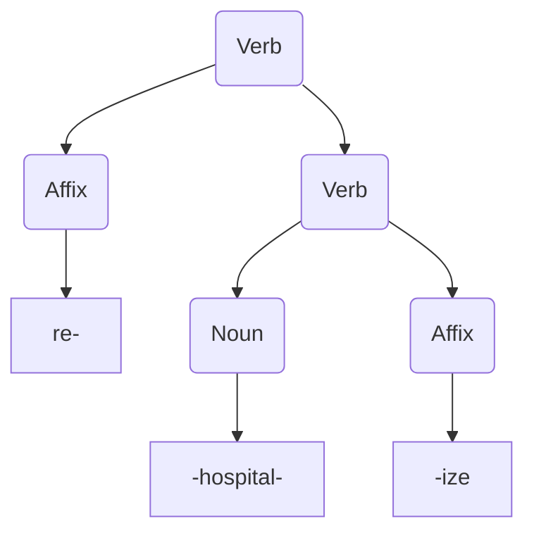

# Lexing & Parsing

Now that we have a foundation of eBNF grammars and context-free grammars we can talk about lexing and parsing.

If you look at the TOC of the Dragon Book, you'll see that chapters 1-9 and 11 are essentially all about parsing and lexing.
At the time, compilers cared a *lot* about locality because it was so hard to fit the entire program into memory.
Compiler had to be architected to work on a tiny chunk of a single program at a time, meaning the parser would request a token from the lexer when it needed to as it was streaming through the input tokens.
Perhaps a single function was processed at a time, code was often generated as the compiler streamed through the input.

This is called a *sinlge-pass compiler*, meaning the compiler as a whole streamed through the entire program once, lexing, parsing, and generating assembly code in one pass.
This was +/-necessary because the primary constraint was fitting all the data structures for the program into memory while the compiler was running.

These compilers were often what-you-see-is-what-you-get for this reason; whatever code you wrote would be streamed directly to assembly after a brief semantic analysis.
Little optimization was done (chapters 12, 13 and 14 of the dragon book are about optimization, but what would be considered extremely basic optimization today due to the memory constraints).


```
              Example of a streaming single-pass compiler           
              -------------------------------------------           
                                                                    
                                                                    
                        Source Code (test.c)                        
                      ┌───────────────────────┐                     
                      │                       │                     
     ┌────────────────┼─ int func1() {...}    │                     
     │                │  int func2() {...}    │                     
     │                │  int func3() {...}    │                     
     │                │                       │                     
     │                └───────────────────────┘                     
     │                                                              
     │   ┌─────────────────────────────────────────────────────┐    
     │   │                    Compiler                         │    
     │   │                 --------------                      │    
     │   │                                                     │    
     └───┼───►Lexer ─────► Parser ──► Semantics ───► Codegen  ─┼──┐ 
         │            ▲            ▲             ▲             │  │ 
         │            │            │             │             │  │ 
         │          Tokens       Parse          AST            │  │ 
         │                       Tree                          │  │ 
         └─────────────────────────────────────────────────────┘  │ 
                        ┌──────────────────┐                      │ 
                        │  Assembly        │                      │ 
                        │                  │                      │ 
                        │  func1:          │◄─────────────────────┘ 
                        │    ldr x1, [sp]  │                        
                        │                  │                        
                        └──────────────────┘                        

```

This is not often the case today for a variety of reasons.
Compilers today do lots of whole-program optimization and even link-time optimization (LTO) that does a bit of optimization that can only be done when the entire program and all its libraries are linked together.

```
                                                            
        Example of a modern compiler (llvm)
        -----------------------------------                 
                                                            
                                                            
              Source Code (test.c)                          
            ┌───────────────────────┐                       
            │                       │                       
    ┌───────┼─ int func1() {...}    │                       
    │       │  int func2() {...}    │                       
    │       │  int func3() {...}    │                       
    │       │                       │                       
    │       └───────────────────────┘                       
    │                                                       
    │  ┌──────────────────────────────────┐                 
    │  │            Compiler              │                 
    │  │         --------------           │                 
    │  │      ┌──────────────────┐        │                 
    └──┼────► │    Frontend      │        │  Clang          
       │      │                  │        │                 
       │      │ ┌─► Lexer   ───┐ │        │                 
       │      │ │              │ │        │                 
       │      │ └── Parser  ◄──┘ │        │                 
       │      └──────────────────┘        │                 
       │                                  │                 
       │              │                   │                 
       │              │   IR              │                 
       │              ▼                   │                 
       │ ┌─────────────────────────────┐  │                 
       │ │         Optimizer           │  │  Opt            
       │ │                             │  │                 
       │ │                             │  │                 
       │ │      pass1  │ ◄─────Also IR │  │                 
       │ │             │               │  │                 
       │ │             │               │  │                 
       │ │      pass2  ▼ │             │  │                 
       │ │               │             │  │                 
       │ │               │             │  │                 
       │ │      pass3    ▼   │         │  │                 
       │ │                   │         │  │                 
       │ │                   │         │  │                 
       │ │      pass2 again  ▼         │  │                 
       │ │                             │  │                 
       │ └─────────────────────────────┘  │                 
       │                                  │                 
       │   ┌───────────────────────────┐  │                 
       │   │     Code Generation       │  │                 
       │   │                           │  │   LLC           
       │   │ Target-independent core   │  │                 
       │   │                           │  │                 
       │   │ Regalloc                  │  │                 
       │   │                           ├──┼──┐              
       │   │ Actual codegen            │  │  │              
       │   │                           │  │  │              
       │   │                           │  │  │              
       │   │                           │  │  │              
       │   └───────────────────────────┘  │  │              
       │                                  │  │              
       └──────────────────────────────────┘  │              
                                             │              
                   ┌──────────────────┐      │              
                   │  Assembly        │      │              
                   │                  │      │              
                   │  func1:          │◄─────┘              
                   │    ldr x1, [sp]  │                     
                   │                  │                     
                   └───────┬──────────┘                     
                           │                                
                           │  Linker (lld)                  
                           │                                
                   ┌───────▼──────┐                         
                   │   Program    │                         
                   │              │                         
                   └──────────────┘
```

<!-- The memory constraints that required early compiler developers to structure the compiler in this way largely do not apply  -->

## Context Free Grammar -> AST

In language theory, the syntax of a group of *morphemes* has a hierarchichal structure, just like Chomskey laid out in the theory of Universal Grammar.[^ast_in_english]

For example take the word *rehospitalize*.

This could be broken into a few chunks:

> re + hospital + ize

The `+` symbol doesn't quite do the word justice, since "re" and "ize" have different relationships to the word "hospital".
This *tree* structure conveys that structure a bit better:



This doesn't just apply to the semantics of individual words, but sentances too (and all of language, according to Chomsky).

This nice presentation on the tree structure of the syntax in a language gives us this example:[^ast_in_english]
~~~admonish quote
Again, this structure is "hidden" from us - but we have evidence that it is there.
Sentences are made up of words, but we can show that there's another level of organization in
between - that is, that sentences are made up of phrases, and phrases are made of words. By the
end of this section you will see that what we really need to do is represent the sentence above with
a tree:

*I watched the movie about snakes in August*
~~~

From which we can write a syntax tree:

~~~mermaid
%% I watched the movie about snakes on a plane in August
graph TD;
    A(Sentance)-->|Noun|B(I);
    A-->C(.);
    C-->D(.);
    D-->|Verb|E(watched);
    D-->I(.);
    I-->|Determiner|j(the);
    I-->k(.);
    k-->|Noun|1(movie);
    k-->l(.);
    l-->|Pronoun|2(about);
    l-->|Noun|3(snakes);
    C-->F(.);
    F-->|Pronoun|G(in);
    F-->|Noun|H(August);
~~~

This tree structure conveys more semantic information about the sentance than just the words themselves, especially for someone not familiar with English.
As a native speaker, it's intuitive to me how this tree should be structured from the text itself, but for someone who doesn't speak English, this tree must be constructed with a bit more effort.

A compiler constructs a tree just like this, but from the source code instead of an english sentance.
This structure is called an *abstract syntax-tree*.
It's an in-memory structure that allows the syntax of the program to be handled by the program.

This tree is often constructed by the parser from the *tokens* it gets from the lexer.
The lexer consumes text from the input and creates a *token* is basically just the category of character or group of characters based on the grammar of the input language, often with an associated location in the source so better diagnostics can be given later on.

Here's an example from Clang, a C compiler front-end part of the LLVM project's suite of compiler tools:
```
$ echo 'int main(){printf("running\n");return 0;}' > t.c
$ clang -fsyntax-only -Xclang -dump-tokens t.c
int 'int'        [StartOfLine]  Loc=<t.c:1:1>
identifier 'main'        [LeadingSpace] Loc=<t.c:1:5>
l_paren '('             Loc=<t.c:1:9>
r_paren ')'             Loc=<t.c:1:10>
l_brace '{'             Loc=<t.c:1:11>
identifier 'printf'             Loc=<t.c:1:12>
l_paren '('             Loc=<t.c:1:18>
string_literal '"running\n"'            Loc=<t.c:1:19>
r_paren ')'             Loc=<t.c:1:30>
semi ';'                Loc=<t.c:1:31>
return 'return'         Loc=<t.c:1:32>
numeric_constant '0'     [LeadingSpace] Loc=<t.c:1:39>
semi ';'                Loc=<t.c:1:40>
r_brace '}'             Loc=<t.c:1:41>
eof ''          Loc=<t.c:1:42>
```

We can also look at the AST:
```
$ clang -Xclang -ast-dump t.c
|-FunctionDecl 0x140015318 <t.c:1:1, col:41> col:5 main 'int ()'
| `-CompoundStmt 0x14002ddb0 <col:11, col:41>
|   |-CallExpr 0x14002dd28 <col:12, col:30> 'int'
|   | |-ImplicitCastExpr 0x14002dd10 <col:12> 'int (*)(const char *, ...)' <FunctionToPointerDecay>
|   | | `-DeclRefExpr 0x14002dc38 <col:12> 'int (const char *, ...)' Function 0x140015870 'printf' 'int (const char *, ...)'
|   | `-ImplicitCastExpr 0x14002dd68 <col:19> 'const char *' <NoOp>
|   |   `-ImplicitCastExpr 0x14002dd50 <col:19> 'char *' <ArrayToPointerDecay>
|   |     `-StringLiteral 0x14002dca0 <col:19> 'char[9]' lvalue "running\n"
|   `-ReturnStmt 0x14002dda0 <col:32, col:39>
|     `-IntegerLiteral 0x14002dd80 <col:39> 'int' 0
```

This corrolates directly to the linguistic syntax tree we created from the sentance earlier.

---

[^ccarruth_cppnow2023]: [Modernizing Compiler Design for Carbon Toolchain - Chandler Carruth - CppNow 2023](https://youtu.be/ZI198eFghJk?si=Ju9jL8-CzL31QaAz)
[^asciiflow]: [ascii flow for ascii diagrams](https://asciiflow.com/#/)
[^cfg_wpi_edu]: [Context-Free Grammars lecture slides](https://web.cs.wpi.edu/~kal/courses/compilers/module2/RastislavBodikcfg.PDF)
[^ast_in_english]: [UMass lecture slides on syntax](https://people.umass.edu/moiry/syntax.pdf)
