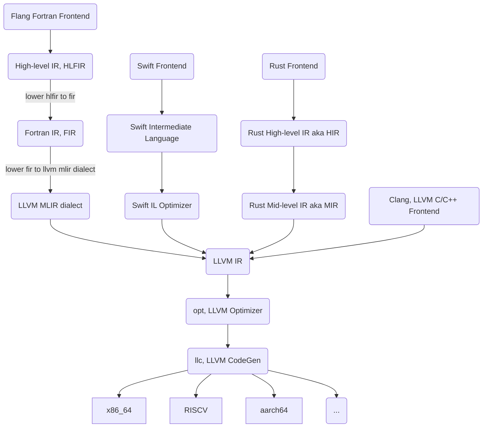

# What is an optimizer?

When discussing compilers, we often focus on the front-end (parsing and early analysis) or the back-end (code generation).
However, the unsung hero of modern compiler design is the middle-end -
the optimization phase that sits between input analysis and code generation. 

The middle-end is arguably the most reusable component of a compiler.
Taking LLVM for example, a trove of compilers use LLVM IR as their target for code generation
and then rely on LLVM Opt (LLVM's optimizer/middle-end) for later optimization
and then LLC for code generation.

This optimizer modularity (or at least its capability to use various FEs) is part of what
helped GCC take off as a compiler project during the advent of open-source compilers
([see this section from the history chapter](00-History.md#advent-of-open-source-1990s-)).

## Visualization: The Factorio Analogy

To visualize how these passes work, imagine a Factorio-style factory.
The IR flows along conveyor belts, and each optimization pass is like a series of robotic arms and sorters watching the stream of code.
When a sorter recognizes a pattern it's designed to optimize - say,
a loop with an invariant computation - it plucks that piece of IR off the belt.
The robotic arm then transforms the code (moving the invariant computation out of the loop) and places the optimized version back on the belt.
This process continues, with multiple specialized sorters and optimizers working in sequence, each improving the code in its own way.

~~~admonish todo
- introduce IRs, passes, phase ordering, link to those sections so the
    transition feels more natural
~~~
